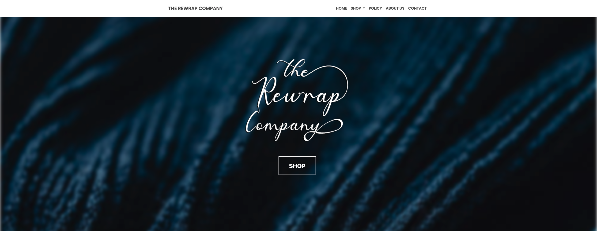
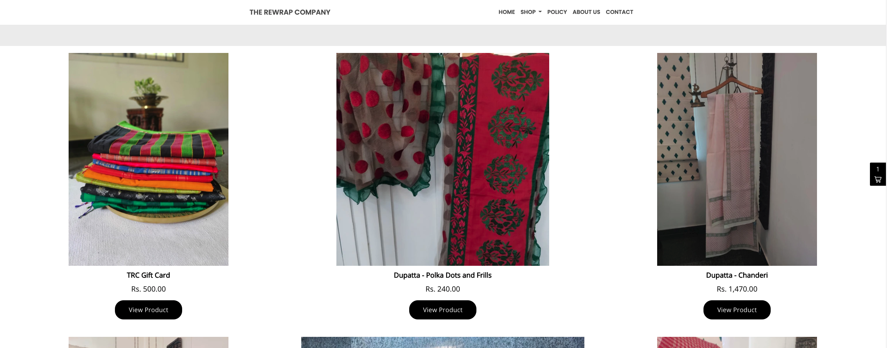

# [The Rewrap Company](https://www.rewrap.store)

## A minimalistic static site built with HTML, CSS, Bootstrap and Vanilla Javascript. Backend and dynamic components handled by Shopify.

---

## Built Using

- HTML
- CSS
- Bootstrap
- Vanilla JavaScript

---

## Backend Components

Backend Components handled by Shopify. [Shopify](https://www.shopify.com) is a commerce platform that allows anyone to set up an online store and sell their products. Merchants can also sell their products in person with Shopify POS.

### Shopify Lite

Shopify Lite is a plan for merchants who are looking to sell in-person (via POS lite) or add a buy button to their existing website. With Shopify Lite, you get features to view reports, issue gift cards, and split bills, among others. You can’t build an online store with Shopify Lite.

### Why did we use Shopify Lite?

The pricing of the base Shopify plan is $29/month. The pricing of Shopify Lite is $9/month. Shopify Lite provides all the features of the Shopify Admin, as well as the ability to add buy buttons, while the base Shopify plan does the same, but also includes an online store. Hence, in order to save costs, we advised The Rewrap Company to build a static site and integrate Shopify Lite.

---

## Dynamic Changes

As Shopify handles the backend, we were able to host our site on github pages. When an item in a collection is changed on the Shopify Admin, as long as the buy button for the collection has already been pasted into the code for the website on the github repository, the change is automatically reflected on the site. Hence, once the collections and website are done, the client no longer needs to access the code to change inventory and items.

---

## What is the Rewrap Company?

The Rewrap Company is a company that aims to promote sustainablity and reusability of clothes - specifically traditional Indian clothing. They do this by 'rewrapping' old products into 'new' products. These products have been loved before, but now, they can be loved once again. Their vision is to upcycle preloved fabrics, thereby eliminating production waste. The Rewrap Company quickly realised that there were many who support the concept of upcycling, and they hope to spread this company to all those that care about the environment.

---

## What is DevLoad?

Devload is a business that specialies in web development. We aim to create clean, elegenat and intuitive websites for our clients. Our goal at Devload is to not only build websites that suit the clients needs, but also to inspire other young people and students to take initiatives of their own, by sharing our journey on [our YouTube Channel](https://www.youtube.com/channel/UC86I6tEmKmfNEAgfwwnOYBA). You can find us at [our website](https://www.devload.org). We are open to create wesbites for anybody who needs one.
